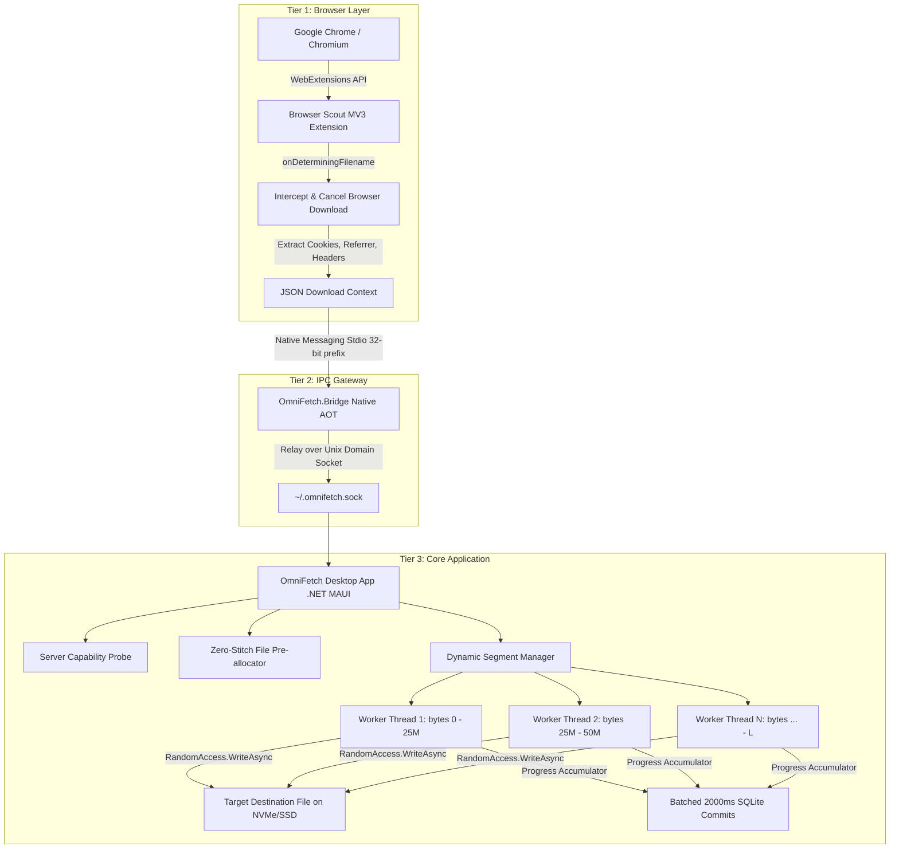
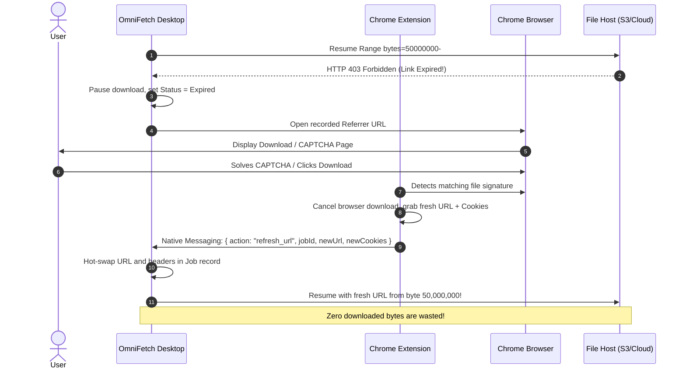

# OmniFetch: Next-Generation macOS Download Accelerator

<p align="center">
  <b>Enterprise-Grade, Multi-Stream Download Accelerator for macOS</b><br>
  <i>Inspired by Internet Download Manager (IDM) — Re-engineered for macOS with .NET 10, Mac Catalyst, and Chrome Manifest V3.</i>
</p>

<p align="center">
  
  
  
  
  
</p>

---

## 📑 Table of Contents

1. [Executive Summary & Vision](#1-executive-summary--vision)
2. [Why OmniFetch? (IDM vs. OmniFetch)](#2-why-omnifetch-idm-vs-omnifetch)
3. [System Architecture & 3-Tier Topology](#3-system-architecture--3-tier-topology)
4. [The Core Download Engine](#4-the-core-download-engine)
   - [Server Capability Probe & Handshake](#41-server-capability-probe--handshake)
   - [Zero-Stitch Lock-Free Disk I/O](#42-zero-stitch-lock-free-disk-io)
   - [Dynamic Byte-Range Bisection Algorithm (Half-Splitting)](#43-dynamic-byte-range-bisection-algorithm-half-splitting)
   - [Zero-Allocation Memory & Buffer Management](#44-zero-allocation-memory--buffer-management)
   - [Connection Pooling & Socket Tuning](#45-connection-pooling--socket-tuning)
   - [Token Bucket Bandwidth Limiter & Smart Limiter](#46-token-bucket-bandwidth-limiter--smart-limiter)
5. [State Persistence, Resilience & Expired Link Refresh](#5-state-persistence-resilience--expired-link-refresh)
   - [Database Schema & State Tracking](#51-database-schema--state-tracking)
   - [Write-Behind Decoupled Progress Flushing](#52-write-behind-decoupled-progress-flushing)
   - [Cache Validation & Resume Integrity](#53-cache-validation--resume-integrity)
   - ["Refresh Download Address" Subsystem](#54-refresh-download-address-subsystem)
6. [Browser Integration & Native IPC Bridge](#6-browser-integration--native-ipc-bridge)
   - [Chrome Manifest V3 Extension](#61-chrome-manifest-v3-extension)
   - [Native AOT IPC Bridge Daemon](#62-native-aot-ipc-bridge-daemon)
   - [Keyboard Interception Overrides](#63-keyboard-interception-overrides)
7. [Streaming Media Interception (Video Grabber)](#7-streaming-media-interception-video-grabber)
   - [Manifest Sniffing (HLS & MPEG-DASH)](#71-manifest-sniffing-hls--mpeg-dash)
   - [Decoupled Stream Demuxing & Remuxing](#72-decoupled-stream-demuxing--remuxing)
   - [Bundled Lossless FFmpeg Assembly](#73-bundled-lossless-ffmpeg-assembly)
8. [Site Grabber, Spider & Automation](#8-site-grabber-spider--automation)
   - [Recursive Web Spider](#81-recursive-web-spider)
   - [Queue Management & Cron Scheduling](#82-queue-management--cron-scheduling)
   - [Command Line Interface (CLI) Matrix](#83-command-line-interface-cli-matrix)
9. [macOS Platform Engineering](#9-macos-platform-engineering)
   - [App Nap & Sleep Prevention](#91-app-nap--sleep-prevention)
   - [App Sandboxing & Entitlements](#92-app-sandboxing--entitlements)
   - [UI Responsiveness & 4 Hz Telemetry Throttling](#93-ui-responsiveness--4-hz-telemetry-throttling)
   - [VoiceOver Accessibility & Keyboard Navigation](#94-voiceover-accessibility--keyboard-navigation)
10. [Repository Structure](#10-repository-structure)
11. [Master Implementation Roadmap & Phase Checklist](#11-master-implementation-roadmap--phase-checklist)
12. [Developer Guide & Getting Started](#12-developer-guide--getting-started)

---

## 1. Executive Summary & Vision

**Internet Download Manager (IDM)** on Windows has long been regarded as the gold standard of download accelerators. Its speed stems not from magic, but from **multi-stream HTTP Range requests paired with dynamic file segmentation and aggressive connection reuse**.

However, for developers and power users migrating to **macOS**, no native application provides IDM's raw performance, browser capture reliability, dynamic half-splitting segmentation, and power features (such as expired link hot-swapping and video sniffing).

**OmniFetch** is engineered to fill this exact void. It replicates the complete feature set, user experience, and capabilities of IDM, while leveraging modern systems programming to eliminate IDM's 20-year-old architectural bottlenecks.

```
       ┌────────────────────────────────────────────────────────┐
       │                   OmniFetch Vision                     │
       │  IDM Speed & Features + macOS Elegance & Modern Arch   │
       └────────────────────────────────────────────────────────┘
                                   │
         ┌─────────────────────────┼─────────────────────────┐
         ▼                         ▼                         ▼
  Zero-Stitch I/O          Dynamic Bisection         3-Tier Decoupled
  No temp files            Steals bytes from         Browser Extension
  No 99% freeze            lagging connections       + Native AOT Bridge
  Zero write penalty       100% bandwidth usage      + MAUI Catalyst App
```

---

## 2. Why OmniFetch? (IDM vs. OmniFetch)

While IDM was revolutionary in the early 2000s, its architecture is constrained by legacy 32-bit Win32 design choices. OmniFetch adopts all of IDM's proven strengths while leapfrogging its weaknesses:

| Feature / Subsystem | Standard Browser / cURL | Legacy IDM (Win32) | **OmniFetch (macOS Target)** |
| :--- | :--- | :--- | :--- |
| **Download Streams** | Single stream (1 connection) | Multi-stream (up to 32 connections) | **Multi-stream (up to 32 connections)** |
| **Segmentation Strategy** | None | Dynamic Bisection (Half-Splitting) | **Dynamic Bisection (Half-Splitting)** |
| **Disk Write Architecture** | Sequential append | Writes separate `.tmp_n` files to disk per chunk | **Direct Zero-Stitch `RandomAccess` to target file** |
| **File Assembly Phase** | None | Reads & copies all `.tmp_n` files into final file (**2x write penalty, 99% freeze**) | **Zero assembly time (0.00 seconds)** — completed on final byte! |
| **Memory Allocation** | Standard managed buffers | Win32 buffer pool | **Zero-allocation `ArrayPool<byte>` rented buffers** |
| **Straggler Handling** | Stalls completely | Idle threads split lagging chunks | **Idle threads dynamically bisect largest remaining chunk** |
| **Expired Link Recovery** | Download lost, restart 0% | "Refresh Download Address" hot-swap | **Automatic Referrer re-capture + socket hot-swap** |
| **Connection Protocol** | HTTP/1.1 or HTTP/2 | HTTP/1.1 keep-alive pooling | **HTTP/1.1, HTTP/2, and Native HTTP/3 (QUIC)** |
| **Platform Target** | All | Windows 32-bit Win32 only | **macOS Native (Apple Silicon & Intel Mac Catalyst)** |
| **OS Power Integration** | System defaults | Win32 ACPI Wake Timers & Sleep block | **macOS `NSProcessInfo` App Nap & Sleep Prevention** |

---

## 3. System Architecture & 3-Tier Topology

OmniFetch decouples download detection, inter-process communication, and multi-threaded stream orchestration into a resilient **3-Tier Architecture**:



### Detailed Component Roles:

1. **Tier 1: Browser Scout (Chrome MV3 Extension)**
   - Located in `extension/`.
   - Listens on `chrome.downloads.onDeterminingFilename` to catch downloads before Chrome touches the disk.
   - Instantly calls `chrome.downloads.cancel(downloadItem.id)`.
   - Extracts complete HTTP context: target URL, referrer, authentication cookies for the domain, user-agent, custom headers, and suggested file name.
   - Sends payload to Tier 2 via Chrome Native Messaging.

2. **Tier 2: Native IPC Bridge (`OmniFetch.Bridge`)**
   - High-performance, lightweight headless console daemon compiled with **.NET Native AOT**.
   - Starts in milliseconds with near-zero memory footprint.
   - Reads 32-bit little-endian length-prefixed JSON from `stdin`.
   - Relays the JSON context over a local macOS Unix Domain Socket (`~/.omnifetch.sock`) to the core desktop app.
   - Responds to Chrome with an acknowledgment JSON over `stdout`.

3. **Tier 3: Core Application (`OmniFetch.Core` & `OmniFetch.App`)**
   - Headless core engine and .NET MAUI Mac Catalyst GUI.
   - Hosts the SQLite queue database, zero-stitch disk writer, dynamic segmentation coordinator, and token bucket bandwidth shaper.

---

## 4. The Core Download Engine

### 4.1 Server Capability Probe & Handshake

Before spawning worker threads, OmniFetch probes the target server to inspect capabilities:

```
Client                                                  Remote Server
  │                                                           │
  ├─── 1. HTTP HEAD Request (Cookies, User-Agent, Referrer) ──►│
  │    (Fallback: GET with Range: bytes=0-0)                  │
  │                                                           │
  │◄── 2. HTTP 200 / 206 Response Headers ────────────────────┤
  │       - Accept-Ranges: bytes                              │
  │       - Content-Length: L (e.g. 104,857,600 bytes)        │
  │       - ETag: "xyz-12345"                                 │
  │       - Last-Modified: Wed, 09 Sep 2026 12:00:00 GMT      │
  │       - Content-Disposition: filename="setup.dmg"         │
  │                                                           │
```

- **Accept-Ranges Discovery**: If `Accept-Ranges: bytes` or HTTP 206 is returned, multi-stream acceleration is enabled. If absent, the engine falls back gracefully to single-stream download.
- **Probe Fallback**: Many CDNs and pre-signed S3 links reject or strip headers on `HEAD` (returning HTTP 403 or 405). OmniFetch automatically falls back to an initial `GET` probe with `Range: bytes=0-0`.
- **Suggested File Name**: Parsed from RFC 6266 `Content-Disposition` (`filename*="UTF-8''..."` and `filename="..."`), with URL path decoding as fallback.

---

### 4.2 Zero-Stitch Lock-Free Disk I/O

The single greatest flaw of Internet Download Manager is its file rebuilding phase:

```
[IDM Legacy Approach]
Stream 0 ──► Write Build.iso.tmp_0 ┐
Stream 1 ──► Write Build.iso.tmp_1 ├─► Download finishes at 100% ──► [REBUILDING PHASE]
Stream 2 ──► Write Build.iso.tmp_2 ├─► Read all .tmp files ────────► Append to Build.iso
Stream 3 ──► Write Build.iso.tmp_3 ┘   (2x Write amplification!)       (Minutes of 99% stall!)

[OmniFetch Modern Zero-Stitch Architecture]
                    ┌──► RandomAccess.WriteAsync(Handle, buf, offset_0) ──┐
Total File Size ────┼──► RandomAccess.WriteAsync(Handle, buf, offset_1) ──┼──► Direct Final File
Pre-allocated via   ├──► RandomAccess.WriteAsync(Handle, buf, offset_2) ──┤    (Zero Stitching!
RandomAccess.SetLength └► RandomAccess.WriteAsync(Handle, buf, offset_3) ──┘     0.00s Assembly!)
```

#### Lock-Free Concurrent Writes
- Target file is opened with `FileAccess.ReadWrite`, `FileShare.ReadWrite`, and `FileOptions.Asynchronous`.
- File size is pre-allocated instantly using `RandomAccess.SetLength(fileHandle, totalBytes)`.
- Concurrent worker threads execute `RandomAccess.WriteAsync(fileHandle, buffer, currentOffset, cancellationToken)`.
- Operating system kernel writes directly to the exact file block without needing locks, mutexes, or shared file pointers!

---

### 4.3 Dynamic Byte-Range Bisection Algorithm (Half-Splitting)

Traditional downloaders split a file into static, immutable chunks (e.g. 4 chunks of 25 MB). If Thread 4 hits a congested network route, the entire download waits for that single "straggler" while other threads sit idle.

OmniFetch implements **Dynamic Bisection Work-Stealing**:

```
Time T0: File [0 MB ────────────────────────────────────────────────────────── 100 MB]
Connection 0 starts [0 MB ──────────────────────────────────────────────────── 100 MB]

Time T1: Idle connection 1 spins up.
Workload is bisected:
Conn 0: [0 MB ──────── 50 MB]
Conn 1:                      [51 MB ────────────────────────────────────────── 100 MB]

Time T2: Conn 0 is super-fast (already at 40 MB). Conn 1 is slow (at 55 MB).
Conn 0 completes [0 MB ────── 50 MB].
Scheduler inspects active connections: Conn 1 has largest remaining workload (100 - 55 = 45 MB).
Workload is bisected at midpoint (55 + 22 = 77 MB):
Conn 1 clamped:              [55 MB ───────── 77 MB]
Conn 0 steals:                                      [78 MB ─────────────────── 100 MB]
```

#### The Mathematical Bisection Logic:
1. Active remaining workload for connection $i$:
   $$R_i = \text{EndByte}_i - \text{CurrentByte}_i$$
2. Identify connection $k$ possessing maximum remaining unread workload:
   $$k = \arg\max_i (R_i)$$
3. If $R_k > \text{MinSplitThreshold}$ (default 5 MB, configurable down to 512 KB):
   $$\text{splitPoint} = \text{CurrentByte}_k + \left\lfloor \frac{R_k}{2} \right\rfloor$$
4. **Atomically clamp** connection $k$'s endpoint:
   $$\text{EndByte}_k \leftarrow \text{splitPoint} - 1$$
5. Dispatch the available idle connection $j$ to the new range:
   $$\text{Range: bytes}=\text{splitPoint}-\text{originalEndByte}_k$$

---

### 4.4 Zero-Allocation Memory & Buffer Management

To prevent garbage collection pauses during multi-gigabit downloads:
- Zero allocations of `byte[]` arrays inside the download loop.
- Buffers are rented from `ArrayPool<byte>.Shared.Rent(81920)` (80 KB).
- Data is consumed via `HttpCompletionOption.ResponseHeadersRead`.
- Buffers are returned to the pool immediately in a `finally` block:
```csharp
byte[] buffer = ArrayPool<byte>.Shared.Rent(81920);
try
{
    while ((bytesRead = await responseStream.ReadAsync(buffer.AsMemory(0, buffer.Length), ct)) > 0)
    {
        await RandomAccess.WriteAsync(fileHandle, buffer.AsMemory(0, bytesRead), currentFileOffset, ct);
        currentFileOffset += bytesRead;
        _segmentTracker.UpdateProgress(startOffset, currentFileOffset);
    }
}
finally
{
    ArrayPool<byte>.Shared.Return(buffer);
}
```

---

### 4.5 Connection Pooling & Socket Tuning

Network requests are managed via a tuned `SocketsHttpHandler`:
- `PooledConnectionLifetime = TimeSpan.FromMinutes(15)`: Sockets stay warm, bypassing TCP 3-way handshakes and TLS renegotiation.
- `PooledConnectionIdleTimeout = TimeSpan.FromMinutes(2)`: Reclaims unused connections.
- `MaxConnectionsPerServer = 64`: Allows high concurrency per domain.
- `EnableMultipleHttp2Connections = true`: Multi-stream HTTP/2 multiplexing.
- Socket receive buffers tuned to match the Bandwidth-Delay Product:
  $$\text{BDP} = \text{Bandwidth} \times \text{RTT}$$

---

### 4.6 Token Bucket Bandwidth Limiter & Smart Limiter

To avoid saturating the user's connection during conference calls or gaming:
- **Token Bucket Algorithm**:
  - Tokens are deposited at bandwidth ceiling rate $R$ (e.g. 500 KB/s).
  - Before reading chunk $B_{\text{chunk}}$ (4 KB - 16 KB), worker checks bucket.
  - If tokens are available, bytes are read and subtracted.
  - If depleted, worker thread yields asynchronously (`Task.Delay`) until tokens replenish.
- **Smart Limiter Mode**:
  - Automatically throttles background downloads by 50–70% when foreground browser requests are detected, then instantly restores full line saturation when browsing stops.

---

## 5. State Persistence, Resilience & Expired Link Refresh

### 5.1 Database Schema & State Tracking

OmniFetch uses **SQLite** backed by **Entity Framework Core**:

```
┌────────────────────────────────────────────────────────┐
│                      DownloadJob                       │
├────────────────────────────────────────────────────────┤
│ Id (UUID)                : PK                          │
│ Url (string)             : Remote resource endpoint    │
│ SavePath (string)        : Destination file on disk    │
│ TotalBytes (long)        : Content length in bytes     │
│ ETag (string?)           : Server entity tag           │
│ LastModified (string?)   : Remote last modified stamp  │
│ Cookies (string?)        : Session auth cookies        │
│ UserAgent (string?)      : Origin user agent           │
│ Referrer (string?)       : Origin referrer page        │
│ Status (enum)            : Queued/Downloading/Paused...│
│ CreatedAt (DateTime)     : Creation timestamp          │
└────────────────────────────────────────────────────────┘
                           │ 1
                           │
                           │ N
┌────────────────────────────────────────────────────────┐
│                    DownloadSegment                     │
├────────────────────────────────────────────────────────┤
│ Id (UUID)                : PK                          │
│ JobId (UUID)             : FK -> DownloadJob.Id        │
│ StartByte (long)         : Starting offset of chunk    │
│ EndByte (long)           : Ending offset of chunk      │
│ CurrentByte (long)       : Current write pointer       │
│ IsCompleted (bool)       : CurrentByte >= EndByte      │
└────────────────────────────────────────────────────────┘
```

---

### 5.2 Write-Behind Decoupled Progress Flushing

Writing segment progress to SQLite on every network chunk would bottleneck I/O. OmniFetch decouples network streams from database transactions:
- Worker threads update **thread-safe in-memory accumulators** (`Interlocked.Add`).
- A background worker flushes state snapshots to SQLite in a single transaction **every 2,000 ms**.
- On sudden power loss, at most 2 seconds of downloaded progress is rewound.

---

### 5.3 Cache Validation & Resume Integrity

When resuming a paused download after hours or days, OmniFetch validates that the remote file has not changed:
1. Sends `If-Match: [stored-ETag]` or `If-Range: [stored-ETag]`.
2. If server returns **HTTP 206 Partial Content**, file is identical; resumption proceeds safely.
3. If server returns **HTTP 412 Precondition Failed** or **HTTP 200 OK**, the remote file has been modified. OmniFetch prompts the user before overwriting existing data.

---

### 5.4 "Refresh Download Address" Subsystem

Cloud storage providers (Google Drive, AWS S3 pre-signed URLs, Rapidgator, Mega) enforce expiring URLs (e.g. 1-hour expiry). Resuming after expiry returns **HTTP 401 Unauthorized, 403 Forbidden, or 410 Gone**.



---

## 6. Browser Integration & Native IPC Bridge

### 6.1 Chrome Manifest V3 Extension
- Declares permissions: `downloads`, `cookies`, `nativeMessaging`, `webRequest`, `declarativeNetRequest`.
- Traps downloads via `chrome.downloads.onDeterminingFilename`.
- Extracts cookies for domain via `chrome.cookies.getAll({ domain: urlObj.hostname })`.
- Forwards context to `com.omnifetch.bridge`.

### 6.2 Native AOT IPC Bridge Daemon
- Standard Chrome Native Messaging executable registered in:  
  `~/Library/Application Support/Google/Chrome/NativeMessagingHosts/com.omnifetch.bridge.json`
- Reads 32-bit little-endian message length prefix, reads JSON payload, relays to `~/.omnifetch.sock`.

### 6.3 Keyboard Interception Overrides
- **ALT Key Hold**: Suppresses OmniFetch interception; lets browser handle download natively.
- **CTRL Key Hold**: Forces OmniFetch to capture any clicked link, regardless of MIME type or extension.

---

## 7. Streaming Media Interception (Video Grabber)

### 7.1 Manifest Sniffing (HLS & MPEG-DASH)
- Background web request sniffer detects `.m3u8` playlists and `.mpd` manifests.
- Injects a discrete floating "Download Video" button above HTML5 `<video>` elements.

### 7.2 Decoupled Stream Demuxing & Remuxing
Modern video platforms stream separate audio (128kbps AAC/Opus) and video (1080p/4K H.264/AV1) streams:
- OmniFetch fetches video and audio streams concurrently using its multi-stream engine.
- Concatenates chunks sequentially into temporary transport streams.

### 7.3 Bundled Lossless FFmpeg Assembly
- Uses an embedded, codesigned macOS FFmpeg static binary.
- Losslessly muxes streams without CPU-intensive re-encoding:
  ```bash
  ffmpeg -f concat -safe 0 -i chunks.txt -c copy -bsf:a aac_adtstoasc final_output.mp4
  ```

---

## 8. Site Grabber, Spider & Automation

### 8.1 Recursive Web Spider
- Asynchronous Breadth-First Search (BFS) crawler.
- Explores target sites by configurable depth ($1 \dots N$).
- Filters assets by MIME types, file masks (`*.jpg`, `*.zip`), and file size thresholds.

### 8.2 Queue Management & Cron Scheduling
- **Multi-Queue Topology**: Users can create isolated queues (e.g. "Work", "Nightly ISOs", "Torrents").
- **Cron Windows**: Scheduled start/stop times (e.g. download only between 2:00 AM and 7:00 AM off-peak).
- **Power Hooks**: Automatic system sleep or app exit upon queue completion.

### 8.3 Command Line Interface (CLI) Matrix
Supports full IDM CLI compatibility:
```bash
omnifetch /d "https://domain.com/file.zip" /p "~/Downloads" /f "Target.zip" /a
```
- `/d [URL]`: Target URL to download.
- `/s`: Start executing active download queue immediately.
- `/p [path]`: Override destination directory.
- `/f [filename]`: Override suggested filename.
- `/q`: Quit OmniFetch after completing download.
- `/n`: Silent mode (suppress dialogs).
- `/a`: Add to queue without starting immediately.

---

## 9. macOS Platform Engineering

### 9.1 App Nap & Sleep Prevention
macOS aggressively throttles background network and CPU activity for minimized windows via "App Nap". OmniFetch engages `NSProcessInfo` to signal latency-critical downloads:
```csharp
#if MACCATALYST
var options = NSActivityOptions.UserInitiated | NSActivityOptions.LatencyCritical;
_activity = NSProcessInfo.ProcessInfo.BeginActivity(options, "OmniFetch Active Transfer");
#endif
```

### 9.2 App Sandboxing & Entitlements
Configured via `Entitlements.plist` to allow user-selected file system locations and outgoing network connections:
- `com.apple.security.network.client`: Allowed.
- `com.apple.security.files.user-selected.read-write`: Allowed.
- `com.apple.security.files.downloads.read-write`: Allowed.

### 9.3 UI Responsiveness & 4 Hz Telemetry Throttling
Emitting thousands of progress events per second will freeze the Mac Catalyst UI thread. UI telemetry updates are throttled to a maximum of **4 Hz (every 250ms)** using `Observable.Sample` or high-resolution timers.

### 9.4 VoiceOver Accessibility & Keyboard Navigation
- Full `SemanticProperties.Description` and `SemanticProperties.Hint` on all buttons and progress bars.
- Keyboard shortcuts: `Space` (Pause/Resume), `Cmd + Backspace` (Cancel download), `Cmd + N` (New download).

---

## 10. Repository Structure

```
OmniFetch/
├── README.md                           <- Master Architecture Guide & Roadmap (This file)
│
├── desktop/                            <- macOS Desktop Application Root
│   ├── OmniFetch.sln                   <- Master .NET 10 Solution
│   ├── src/
│   │   ├── OmniFetch.Core/             <- Phase 1: High-Performance Engine Class Library
│   │   │   ├── Common/                 <- Constants, Enums
│   │   │   ├── Models/                 <- Probes, Snapshots, Segment States, Options
│   │   │   ├── Network/                <- SocketsHttpHandler, Probing, Rate Limiting
│   │   │   ├── Storage/                <- Lock-Free RandomAccess Disk Writer, Allocator
│   │   │   ├── Segmentation/           <- Dynamic Half-Splitting Bisection Manager
│   │   │   ├── Engine/                 <- DownloadEngine, Sessions, Coordination
│   │   │   └── Exceptions/             <- Domain Exceptions (ExpiredUrl, Range, Disk)
│   │   │
│   │   ├── OmniFetch.Bridge/           <- Phase 3: Native AOT Chrome Messaging Host
│   │   │   └── Program.cs              <- Stdio 32-bit JSON to Unix Domain Socket relay
│   │   │
│   │   └── OmniFetch.App/              <- Phase 5: .NET MAUI Mac Catalyst Desktop Application
│   │       ├── Views/                  <- Main Window, Download Dialog, Video Grabber
│   │       ├── ViewModels/             <- CommunityToolkit.Mvvm ViewModels
│   │       └── Platforms/MacCatalyst/  <- App Nap Lock, Entitlements, Native Menus
│   │
│   └── tests/
│       └── OmniFetch.Core.Tests/       <- xUnit Test Suite for Engine & Concurrency
│           ├── HttpProbeTests.cs       <- Server probe and range header tests
│           ├── DiskStorageTests.cs     <- Lock-free RandomAccess writing tests
│           ├── SegmentationTests.cs    <- Dynamic bisection algorithm tests
│           ├── RateLimiterTests.cs     <- Token bucket throughput shaping tests
│           └── IntegrationTests.cs     <- End-to-end multi-stream download tests
│
└── extension/                          <- Chrome Manifest V3 Extension Root
    ├── manifest.json                   <- MV3 configuration & permissions
    ├── background.js                   <- Download interception & cookie harvesting
    ├── content.js                      <- Floating video panel DOM injector
    └── icons/                          <- App icons (16, 48, 128)
```

---

## 11. Master Implementation Roadmap & Phase Checklist

| Phase | Subsystem | Core Goal | Status |
| :---: | :--- | :--- | :---: |
| **Phase 1** | **Core Engine Class Library** | Multi-stream engine, dynamic bisection, lock-free disk I/O, rate limiting | **Completed** |
| **Phase 2** | **SQLite State Engine** | EF Core persistence, write-behind flushing, resume verification | **Completed** |
| **Phase 3** | **Native AOT IPC Bridge** | Headless stdio host to Unix Domain Socket relay | **Completed** |
| **Phase 4** | **Chrome Extension (MV3)** | Download interception, cookies, referrer context dispatch | **Completed** |
| **Phase 5** | **MAUI Mac Catalyst Shell** | Desktop UI, segmented progress bars, App Nap prevention | Pending |
| **Phase 6** | **HLS/FFmpeg Integration** | M3U8 parsing, parallel chunk fetching, lossless remuxing | Pending |

### Detailed Phase 1 Checklist (Core Download Engine)
- [ ] Create `desktop/` and `extension/` directory structure.
- [ ] Initialize master .NET 10 solution `desktop/OmniFetch.sln`.
- [ ] Create `OmniFetch.Core` class library project.
- [ ] Create `OmniFetch.Core.Tests` xUnit test project.
- [ ] Implement `HttpProbeService` (HEAD discovery, GET Range fallback, RFC 6266 filename parser).
- [ ] Implement `DiskStorageService` (`RandomAccess.SetLength` pre-allocation, concurrent lock-free `WriteAsync`).
- [ ] Implement `ArrayPool<byte>` zero-allocation memory recycling.
- [ ] Implement `DynamicSegmentManager` (dynamic bisection / half-splitting algorithm, straggler elimination).
- [ ] Implement `TokenBucketRateLimiter` (bandwidth ceiling, high-resolution async sleep).
- [ ] Implement `DownloadEngine` session coordinator, cancellation, pause/resume, and telemetry snapshots.
- [ ] Implement comprehensive unit and integration test suite in `OmniFetch.Core.Tests`.
- [ ] Validate 100% test pass rate with cryptographic hash integrity verification.

---

## 12. Developer Guide & Getting Started

### Prerequisites
- **macOS** 13.0+ (Ventura, Sonoma, Sequoia, or later).
- **.NET 10 SDK** (Installed at `/Users/ahmed/Library/Application Support/dotnetup/dotnet/sdk/10.0.400/`).
- **Google Chrome** (for extension testing).

### Environment Setup
When running commands in the terminal, ensure environment variables point to your user directory:
```bash
export HOME="/Users/ahmed"
export DOTNET_CLI_HOME="/Users/ahmed"
```

### Running Tests
To run the Phase 1 test suite:
```bash
cd desktop
dotnet test tests/OmniFetch.Core.Tests/OmniFetch.Core.Tests.csproj
```

---

<p align="center">
  <b>OmniFetch</b> — Crafted for high performance on macOS.
</p>
